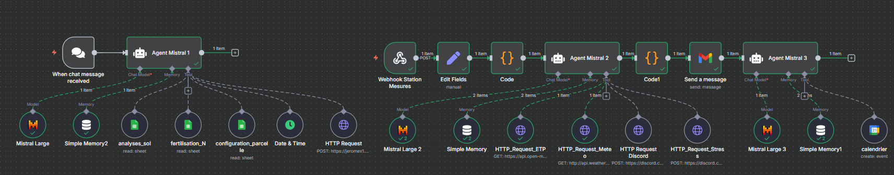

# 🌱 Agent IA Agronomie – Workflow n8n (100% Mistral IA 🇫🇷)



## Présentation

Ce projet met en place un **système multi-agents d’aide à la décision agronomique**, entièrement basé sur les modèles **Mistral IA** (solution française de pointe).  
Le workflow est construit dans **n8n** et relie plusieurs agents spécialisés pour :  

- 📊 **Analyser les données agronomiques** (analyses de sol, tension hydrique, stade phénologique).  
- 🌦️ **Intégrer la météo et l’ETP** pour affiner les conseils d’irrigation.  
- 📩 **Notifier l’utilisateur en temps réel** (Discord, Gmail).  
- 🗓️ **Archiver les bilans** dans Google Calendar pour garder une traçabilité.  
- 💬 **Interagir en conversationnel** : poser une question à l’agent et déclencher une analyse ou une alerte automatiquement.  

👉 100% propulsé par **Mistral IA**, garantissant souveraineté et performance.  

---

## 🧩 Architecture des agents

### **Agent Mistral 1 – Conversationnel**
- Déclenché par un message (`When chat message received`).  
- Connecté aux **Google Sheets** :  
  - `analyses_sol` (propriétés physico-chimiques des sols).  
  - `configuration_parcelle` (paramètres cultures, capteurs).  
- Génère dynamiquement un **JSON structuré** (session_id, tension, enracinement, stade, etc.).  
- Déclenche le **second workflow via HTTP Request**.  

### **Agent Mistral 2 – Analyse irrigation**
- Reçoit les données terrain via `Webhook Station Mesures`.  
- Analyse hydrique avec :  
  - 🌡️ Météo en temps réel (WeatherAPI).  
  - 💧 ETP horaire (Open-Meteo).  
- Déclenche :  
  - **Discord** → notification / alerte stress hydrique.  
  - **Gmail** → rapport détaillé à l’utilisateur.  

### **Agent Mistral 3 – Archivage**
- Nettoie et reformule les messages.  
- Crée un **évènement Google Calendar** intitulé *« Bilan agricole »*.  
- Stocke un résumé clair et daté de l’état de la parcelle.  

---

## 🚀 Cas d’usage

- **Surveillance hydrique** : tension du sol + météo → recommandations d’irrigation.  
- **Alertes stress hydrique** : si le dendromètre indique un stress → alerte automatique sur Discord + mail.  
- **Bilan agronomique** : archivage des relevés dans Google Calendar.  
- **Interface conversationnelle** : dialogue direct avec l’agent pour obtenir un diagnostic ou déclencher un workflow.  

---

## ⚙️ Installation & utilisation

1. Importer le fichier `Agent_IA_Agronomie_Final.json` dans n8n.  
2. Configurer les identifiants :  
   - Compte Mistral Cloud (clé API).  
   - Google Sheets (analyses_sol, configuration_parcelle).  
   - Gmail, Discord, Google Calendar.  
3. Lancer le workflow et interagir via l’agent conversationnel.  

---

## 💾 Structure du dépôt

```
Agent_IA_Agronomie/                       
├── README_fr.md                        # Présentation complète du projet (version française)  
├── README_en.md                        # Project overview in English (English version)  
│
├── screenshots/                        # Captures et démonstrations visuelles  
│   ├── calendar.png                    # Exemple d’archivage d’un résumé dans Google Calendar  
│   ├── message_Discord.png             # Alerte temps réel envoyée sur Discord  
│   ├── workflow.png                    # Vue générale du workflow n8n multi-agents  
│   ├── Workflow_in_Action.gif          # Animation du workflow en fonctionnement  
│   └── selecteur_parcelle.gif          # Démonstration de la configuration d’une parcelle (sélecteur de données)  
│
├── files/                              # Données agronomiques fictives et exemples d’échanges  
│   ├── analyses_sol.xlsx               # Analyses de sol (texture, MO, CEC, pH, etc.)  
│   ├── configuration_parcelle.xlsx     # Paramètres de suivi hydrique (tension, dendromètre, stade phénologique)  
│   ├── fertilisation.xlsx              # Historique de fertilisation azotée (dates, doses, type)  
│   └── ChatBot_conversation.md         # Exemple de dialogue conversationnel avec l’agent  
│
├── code/                               # Scripts et blueprint d’orchestration  
│   ├── Agent_IA_Agronomie_Final.md     # Blueprint n8n complet du workflow multi-agents  
│   └── datas.txt                       # Exemple de JSON transmis d’un workflow à l’autre (interopérabilité API)  
```
---

👉 Ce projet est une **vitrine d’agentique appliquée à l’agronomie** : souveraine, modulaire et directement exploitable pour l’aide à la décision.
